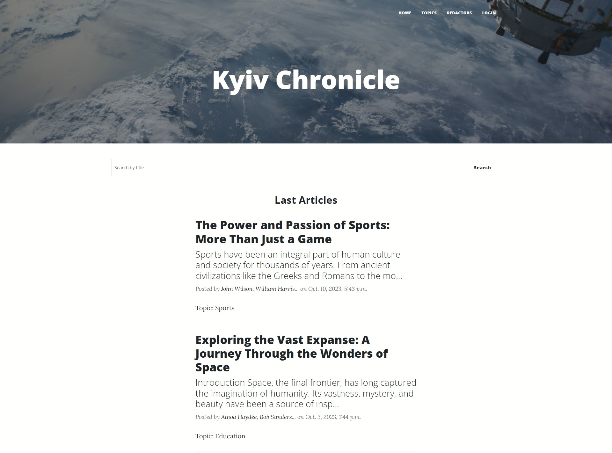

# 📰 Newspaper Agency
Django project for managing newspapers and redactors.

## 🛠️ Installation

1. Clone the repository:
    ```bash
    git clone https://github.com/9rosLove/newspaper-agency.git
    cd newspaper-agency
    ```
2. Set up a virtual environment and activate it:
     - For Windows 🪟:
   
    ```shell
    python3 -m venv venv
    source venv/bin/activate
    ```

     - For Linux 🐧:
    ```bash
    python3 -m venv venv
    source venv/bin/activate
    ```

3. Install the required dependencies:
    ```bash
    pip install -r requirements.txt   
    ```
   
4. Migrate the database:
    ```bash
    python manage.py migrate
    ```
5. Start the development server:
    ```bash
    python manage.py runserver
    ```

## ⭐ Features
- ✏️ Create newspapers
- 📖 Read newspapers
- Update only your own newspapers
- ❌ Delete only your own newspapers
- 👥 Create a redactor
- Update only your own profile

## 🖼️ Demo

